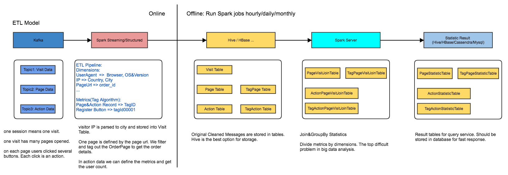

## spark server

spark server is a spark job orchestration framework to help schedule statistics jobs regularly (hourly, daily, monthly, etc.). In a word, it is an OLAP system based on Spark.

Why do we need to use spark server? Spark is a distributed calculating framework which focuses on lower common layer. Users can write any standalone spark application to resolve data analysis problems. However, when it comes to large business analysis requirements, it is less efficient and very hard to schedule many spark jobs one by one. And by spark server, you just focus on the business logical requirements, the server will handle all spark jobs scheduling, performance, functional tests, availability, deployments and reliability.

Spark server is referenced from spark-jobserver project, but much more than that. It focuses on the "best solution" for spark application, removed unnecessary functions for business analysis. We build it based on the real situations we ever had in bigdata pipeline processing. And we added more useful function modules in it, for example, cache improvement on KVStore(rocksdb, windjammer zetascale, etc.), orchestration configuration module and others.

Actually, we build up spark server to make an OLAP(On-Line Analytical Processing) system. Spark is great on distribution calculation, it is integrated as the core of spark server. The server includes many other modules such as query engine for statistic results, distributed database for storage, and data models for processing, etc. All the modules are part of spark server.

## Features

1. Spark-as-Service, REST support for spark job management, easy interfaces.
2. Orchestration of spark jobs, supports to customize business logic as spark jobs dependencies.
3. High reliability with cleaver scheduler based on graph algorithm.
4. High performance for spark jobs with shared sparkContext and cached dataset.
5. Easy to deploy new jobs and data processing pipeline.
6. Offered test framework for spark jobs. (the most important for big data test)
7. Composed with monitoring tool suite which contains spark metrics and executor process monitoring.

## Architecture

The  server has three modules: API which defines the interface for jobs, the Server as core part and the jobs for customer's business logic. The core framework is based on the server.

### Server Architecture

Spark Server runs on a single host. It is composed by REST, scheduler, orchestrator, sparkcontext-server.

1. REST, the interface for interacting with server, manage current spark job plans and running jobs.

2. Orchestrator is designed to manage static spark job plans. Static means the spark job dependencies without timestamp. Spark Job Dependencies are defined in configuration files or database.

3. Scheduler accepts dynamic orchestrations and ad-hoc spark jobs. static spark job plan is submitted by orchestrator with timestamp. So such plans are run by hourly, daily and monthly.

4. The sparkcontext server is spark application driver. It hsa thread pools to start new spark jobs concurrently.

A Job Dependencies Diagram:

- Job-2, 3, 4 dependents on Job-1;
- Job-5 dependents on Job-2, 3;
- Job-6 dependents on Job-4, 5

Defined the pipeline requires to run hourly, the orchestrator submit the pipeline with timestamp to scheduler. The scheduler knows which is to be run in sparkContext Server. After all completed, tell orchestrator to prepare next.

Here if we cache the Job-1 result, Job-2,3,4 could be accelerated and it saves a lot of loading time.

## Scenario

Assume we have an e-commerce website. So we have questions :

Q1: How many people clicked "Register" Button in last hour. (CountDistinct problem)

Q2: What's the cities of top 10 sales last weekend? (Top problem)

Q3: What's the amount sales of each product category last day? (GroupBy problem)

The three problems are the core bottlenecks in big data analysis.

